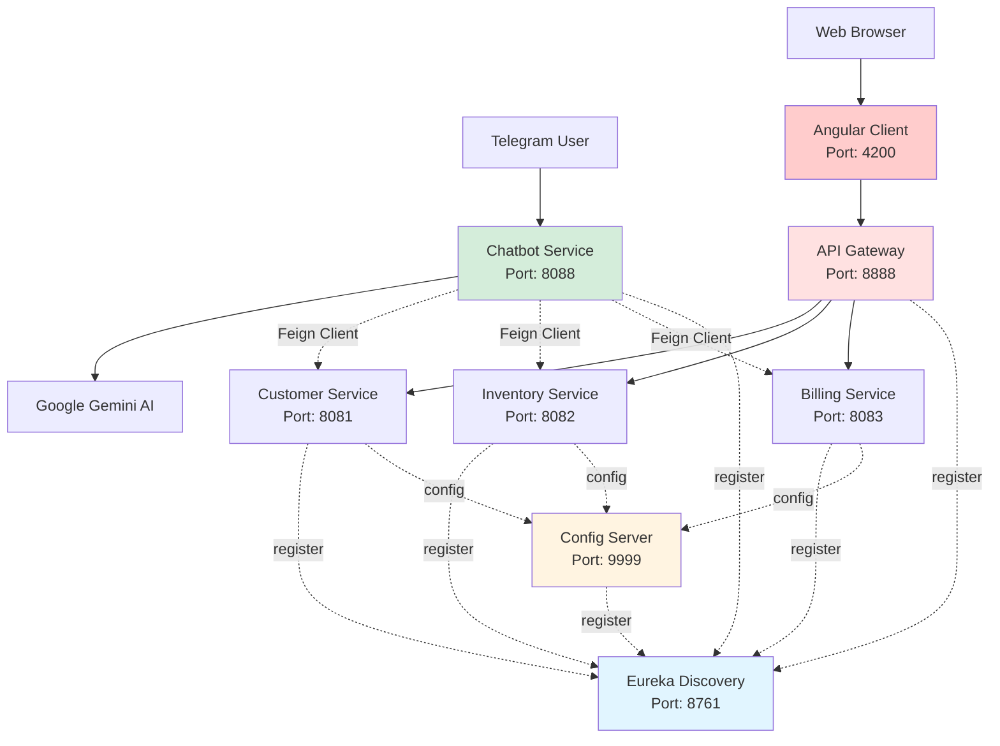

# E-Commerce Microservices Platform

A microservices-based e-commerce application built with Spring Boot backend and Angular frontend. Includes service discovery, API gateway, and an AI-powered Telegram chatbot.

## Architecture

The system consists of 8 services:

| Service | Port | Purpose |
|---------|------|---------|
| Discovery Service | 8761 | Eureka service registry |
| Config Service | 9999 | Centralized configuration |
| Gateway Service | 8888 | API routing |
| Customer Service | 8081 | Customer management |
| Inventory Service | 8082 | Product catalog |
| Billing Service | 8083 | Invoice generation |
| Chatbot Service | 8088 | Telegram bot with Gemini AI |
| Angular Client | 4200 | Web UI |

### Architecture Diagram



## Getting Started

### Prerequisites

- Java 17+
- Maven 3.6+
- Node.js 18+ and npm
- Windows (for the batch scripts)

### Quick Start

Start all backend services:

```bash
.\start-services.bat
```

Wait about 2 minutes for all services to start and register with Eureka.

Start the frontend (in a separate terminal):

```bash
cd angular-client
npm install
ng serve
```

### Verify Installation

- Eureka dashboard: http://localhost:8761
- Angular app: http://localhost:4200
- Test API: http://localhost:8888/customer-service/api/customers

### Test the Chatbot

Search for `@Eocmbot` on Telegram and try commands like "List all customers" or "Show me the products".

## Tech Stack

**Backend:**
- Spring Boot 3.3.5
- Spring Cloud (Config, Gateway, Eureka)
- Spring Data JPA + H2
- OpenFeign
- Spring AI + Google Gemini

**Frontend:**
- Angular 17
- Angular Material
- TypeScript
- RxJS

## Development

Build all services:
```bash
mvn clean install
```

Run services individually (start Discovery first, wait 30s between each):
```bash
cd micro-services-app\discovery-service
mvnw spring-boot:run
```

H2 database consoles:
- http://localhost:8081/h2-console (Customer)
- http://localhost:8082/h2-console (Inventory)
- http://localhost:8083/h2-console (Billing)

## Testing

Test APIs via gateway:
```bash
curl http://localhost:8888/customer-service/api/customers
curl http://localhost:8888/inventory-service/api/products
curl http://localhost:8888/billing-service/api/bills
```

Or test directly:
```bash
curl http://localhost:8081/api/customers
```

## Stopping Services

```bash
.\stop-services.bat
```

Press `Ctrl+C` to stop the Angular dev server.

## Project Structure

```
ecom-ii-bdcc-app/
├── docs/                       # Documentation
├── angular-client/             # Angular frontend
├── micro-services-app/
│   ├── config-repo/            # Config files
│   ├── discovery-service/      # Eureka server
│   ├── config-service/         # Config server
│   ├── gateway-service/        # API Gateway
│   ├── customer-service/       # Customer CRUD
│   ├── inventory-service/      # Product CRUD
│   ├── billing-service/        # Invoice CRUD
│   └── chatbot-service/        # Telegram bot
├── start-services.bat
└── stop-services.bat
```

## Documentation

- [Deployment Guide](docs/DEPLOYMENT.md)
- [Testing Guide](docs/TESTING.md)
- [Troubleshooting](docs/TROUBLESHOOTING.md)
- [Startup Scripts](docs/STARTUP_SCRIPTS.md)

## License

MIT License - see [LICENSE](LICENSE) for details.
